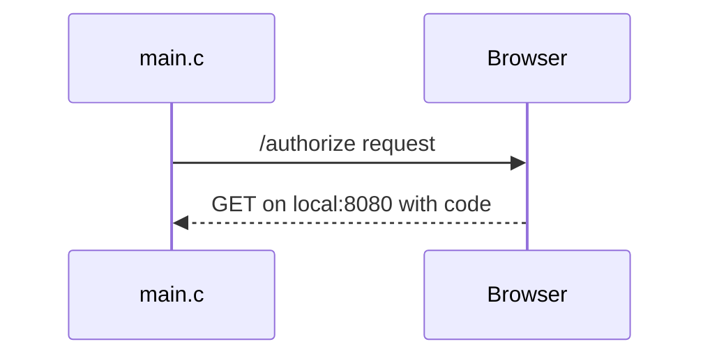

# Liked Song Memories
Liked Song Memories is a program writen in C that will show you what songs you favourited on this day over the years. Acts like what you've seen in Google Photos, SnapChat, Immich, etc.

## Usage
_Note: Both `cmake` and `make` are requisite CLI tools. A C compiler like `gcc` or `clang` is also required._
Wrote in C and uses Make to build.
1. Clone down the repo
2. Use the `run.sh` script like `./run.sh <client_id> <client_secret>`
3. Then it should output something like below (given you have liked a song on this day over the years)

_Note pt.2: I'm aware you don't have the params to run it yourself. Making this program work for anyones Spotify account (not just mine) is a WIP_

## Platform Support
This has been tested on Linux & Mac environments. I have support for windows included but not verified so results may vary.

---

## Project Purpose
I was well aware when I had this project idea that doing it in C would be like trying to eat your dinner with your feet. But I wanted a reason to dig into some C and I knew this project was _doable_, however unfit for purpose.

That being said, the project idea itself was just a cool idea to me. I love the memories feature on Immich that lets me see what photos I took in previous years on this day. I think the project would be more valuable to other people had I made this a webapp and hosted it on Vite or something. But I didn't make it for them, I made it because C is cool.

One of the biggest reasons behind doing that project in the first place was to write some code with **Zero AI** and pick up some programming skills the good 'ol fashioned way.
## Learnings
_Preface: Zero AI was used for this project. A lot of these learnings would have been short conversations had I just asked my LLM_

Safe to say there were a number of things learned from this project. There were 4 foundational things I had to familiarise myself with to make this happen:
1. `libCurl` (library for making HTTP requests)
2. `cJSON` (OSS library for working with JSON objects)
3. Spotify's implementation of OAuth2.0 (Just OAuth2.0 while I was at it)
4. Socket programming

### `libCurl` (Learning C Libraries)
While a HTTP library is an obvious enough req for a web project, I wanted to make this point all about the process of learning libraries for a language like C.

It was a slow but rewarding process to walk through docs on opengroup.org and do relentless trial & error and dead-end google searches. Because my time to solve a problem was so much slower than if I were to use an LLM, I got so familiar with the process of constructing and sending HTTP requests with `libCurl`.

I had a problem one evening where it seemed like no matter what I tried, I couldn't send a GET request with query params. After about an hour of head-banging and re-reading the code for the ump-teenth time, I found I was trying to set post fields on a GET request...

Simple problems like this are easily solved with AI, but I feel that process of trying to solve it myself made me more familiar with the code I was writing, and therefore more comfortable in my knowledge of the library. Also I don't think I'll ever try to add post fields to a GET request ever again.

### `cJSON` (Libraries pt. 2)
This falls under the first learning, but I had a funny example I wanted to make its own point.

After a very brief introduction to this library via a GeeksForGeeks article, I decided to just 'figure it out on my own' because 'how hard can it be?' (spoiler: _very_)

So I debug with the object, read its contents and this is what I construct to parse the response for a given song:

I don't think I need to break down just how bad that code is. Anyways after scratching my head for a while (and being lazy at the thought of building my own recursive walker through the json), I decided to look up the docs (and re-read that GeeksForGeeks article).

Here's what I ended up with after actually learning the library past the core object:

So breaking news: programmer discovers reading docs leads to better wrote code *gasp*

### OAuth2.0
In retrospect, I don't think OAuth is that tricky of a concept. But while learning how to even send my first GET request in C & then having to follow this process just to make the request I want:

My favourite part about this flow was using the browser, and I'll dive into that in the next heading.

So the flow is just `get authorized -> request token using auth code -> make user queries with access token`, but it had been a while since using a 3rd party API so I fumbled through this at the begining.

Though this led me to find Bruno (thanks Conor), which is an OSS postman. So I figured out all my requests first in this before performing them in code.

### Socket programming
This was a fun problem I didn't think that I would have to solve. I found that the initial auth request's response required javascript to work properly, so when I put it into the browser I saw this:

Knowing this had to go in the browser, the flow had to be:

After a few over-engineered attempts at getting my request to be made in the browser, I remembered it just sends HTTP GETs by default, and eventually I stumbled across a post on a forum that showed me the `open` command to launch my browser from my program.

Next was onto the actual socket programming. I had to setup a server socket to wait for a request to port `8080` (couldn't be lower than `100` as linux has those at priority ports). Lucky for me, Spotify allows a redirect URI to be supplied so after you click 'allow' on a page like above, it will take you to that redirect, sending a get request.

From there I can capture the request in my program and use that auth code to make all my subsequent requests. I had done socket programming maybe 5 years ago very briefly, so this wasn't completely knew. Nonetheless, GeeksForGeeks and my familiarisation with the opengroup.org website helped me out massively here.

## Limitations
As this is an MVP, quite a few corners are cut. I tried to do things the proper way when presented to me, but I had a hard call on scope ahead of making this.
- Program assumes you allow access to your Spotify account, no handling if you click decline.
- Program is only setup for my user atm, if I can supply a user email instead of client ID this would open it up to the public.
- Our JSON parsing assumes the parent-child structuring of Spotify's song items do not change.
- The format of the date-time object is assumed too.
- The market is currently hardcoded to `IE`, could open this up as a prop but would only make sense if other people could use this.

## Future Work
Sort of a follow on from limitations, there are things I would love to improve with this app:
- Allow anyone to run this and use their Spotify account
- Add more throrough error handling
- Collect filtered API response into an object to present more stats
